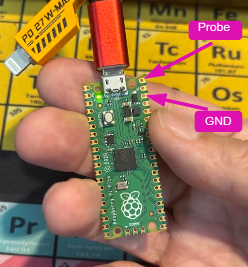
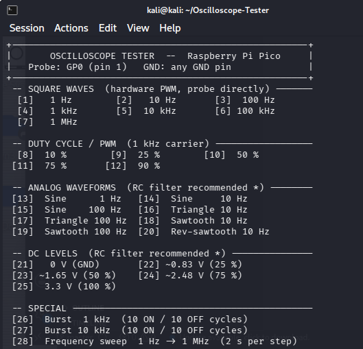

# Quickstart — Oscilloscope Tester

## What you need

- Raspberry Pi Pico with MicroPython installed (see README.md § Software Setup if not done)
- USB cable connected to your PC
- Oscilloscope probe

---

## 1. Connect the Pico

Plug the Pico into your PC via USB.

> **Already run `./deploy.sh` before?** Files stay on the Pico permanently — skip to step 3.

---

## 2. Wire the scope probe

> **Orientation:** Hold the Pico with the chips facing **toward you** and the USB connector at the **top**. The pins on the left edge are numbered top-to-bottom starting at 1.

| Pico pin | Connect to |
|----------|-----------|
| **GP0** (pin 1, top-left next to USB) | Scope probe **tip** |
| **GND** (pin 3, two pins down) | Scope probe **GND clip** |

```
         USB
    +----[   ]----+
GP0 |1             |  <-- probe TIP here
    |2             |
GND |3             |  <-- probe GND clip here
    +-------------+
```



---

## 3. Deploy and launch

**First time only** — upload the firmware and open the terminal:

```bash
./deploy.sh
```

When you see `Connected to MicroPython at /dev/ttyACM0`, press **Ctrl-D** to soft-reset the Pico — the menu will appear.

**Already deployed?** — just reconnect (no re-upload needed):

```bash
mpremote connect /dev/ttyACM0
```

When you see `Connected to MicroPython at /dev/ttyACM0`, the program is already running and waiting silently. **Press Enter** to make the menu appear.

> If nothing happens after pressing Enter, press **Ctrl-D** to soft-reset the Pico — the menu will appear on reboot.

The menu looks like this:

```
+------------------------------------------------------+
|       OSCILLOSCOPE TESTER  --  Raspberry Pi Pico     |
|   Probe: GP0 (pin 1)   GND: any GND pin              |
+------------------------------------------------------+
...
Choice:
```



---

## 4. Run your first test

Type `4` and press **Enter** — this outputs a **1 kHz square wave** on GP0.

> **Note:** The terminal has no echo — you won't see the number appear as you type. Just press the number you want and hit **Enter**; the Pico receives it fine.

Set your oscilloscope to:
- Time/div: **0.2 ms** (shows ~2 complete cycles)
- Volts/div: **1 V**
- Trigger: **CH1, rising edge**

You should see a clean square wave at 3.3 V peak.

Press **any key** to stop and return to the menu.

---

## 5. Reconnecting later (without re-uploading)

Files stay on the Pico permanently. Just reconnect with:

```bash
mpremote connect /dev/ttyACM0
```

Then press **Ctrl-D** to start the menu.

---

## Key controls

| Key | Action |
|-----|--------|
| Type a number + Enter | Start that waveform |
| Any key | Stop waveform, return to menu |
| Ctrl-D | Soft-reset Pico (restarts menu) |
| Ctrl-] or Ctrl-X | Exit the terminal |
